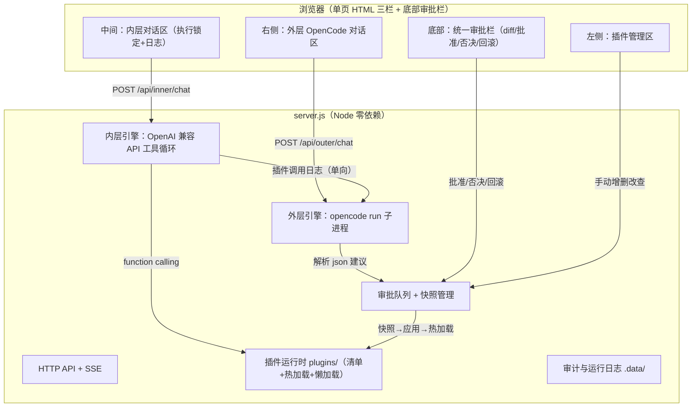

# 双层 Agent 自迭代系统 技术设计

Feature Name: dual-agent-loop
Updated: 2026-08-19

## Description

零依赖 Node.js 单进程 demo：内层 Agent（OpenAI 兼容 API + function calling 插件执行）
与外层 Agent（opencode CLI 子进程）通过「内层日志 → 外层上下文」单向同步形成自迭代闭环。
外层产出的插件修改建议经统一审批（快照 → 应用 → 热加载）落地。

## Architecture



## Components and Interfaces

### 1. 插件运行时（lib/plugins.js）

- 插件形态：`plugins/<name>.js`，`module.exports = { name, desc, essential, params, run(args, ctx) }`
  - params：JSON Schema（进 OpenAI tools 定义）
  - ctx：{ cwd }，run 返回字符串（截断至 8KB）
- 清单：扫描目录 → 读取元信息（require 一次拿 name/desc；损坏文件标记 broken+err）
- 渐进式加载：essential=true 启动即加载常驻；业务插件 lazyLoad——清单可见（进 tools），
  首次调用时 require，缓存复用；热加载 = 清 require.cache 后重载
- 工具定义生成：`[{type:'function', function:{name, description, parameters}}]`

### 2. 内层引擎（lib/inner.js）

- OpenAI 兼容 `POST {base_url}/chat/completions`（stream=true，原生 fetch/https）
- 消息循环：user → assistant(tool_calls) → 执行插件 append tool 结果 → 再请求，
  直到 assistant 无 tool_calls 或达 12 轮上限
- 每轮插件调用记录：`{ts, plugin, args, ok, result(截断), ms}` → .data/inner-log.json（环形最近 200 条）
- SSE 下发事件：text_delta / tool_call / tool_result / done / error

### 3. 外层引擎（lib/outer.js）

- `opencode run --format json`，prompt 经 stdin（沿用 agents-chat 模式，NDJSON 解析 text 事件拼接）
- 上下文模板（单向同步）：
  ```
  [插件清单] name/essential/状态/params 摘要（含代码骨架前 20 行）
  [内层最近日志] 最近 40 条插件调用
  [用户指令] ...
  ```
- 系统提示词（软约束，置于 prompt 首部）：仅修改插件目录、不碰核心 runtime、
  建议必须以 ```json {action:create|update|delete, plugin, code, reason}``` 输出、等待用户批准
- 建议 json 额外支持 batch：`{"proposals":[...]}`，服务端逐条入审批队列

### 4. 审批与快照（lib/approval.js）

- 审批项：{id, action, plugin, code, reason, diff, createdAt, source:'outer'|'manual'}
- 快照：应用前复制受影响文件到 `.data/snapshots/<ts>/` + manifest.json（操作明细+文件清单）；
  快照目录按时间排序仅保留最近 2 个（旧的整目录删除）
- 应用：create/update=写 plugins/<name>.js；delete=删文件；随后 hotReload(plugin)；
  审计日志 append `.data/audit.json`
- 回滚：取最新快照 manifest，恢复其中文件（恢复前再打一次快照），热加载
- 手动操作（左侧增删改）复用同一管线：source='manual'，操作即视为批准（仍先快照）

### 5. HTTP API（server.js）

| 端点 | 说明 |
|---|---|
| GET / | index.html |
| GET /api/plugins | 清单（含加载状态/代码） |
| POST /api/plugins/save | 手动新建/编辑（{name, code}）→ 快照→写→热加载 |
| POST /api/plugins/delete | 手动删除 → 快照→删→热加载 |
| POST /api/inner/chat | SSE 内层对话 |
| POST /api/outer/chat | SSE 外层对话（自动注入上下文） |
| GET /api/proposals | 待审批列表 |
| POST /api/proposals/decide | {id, approve} 批准/否决 |
| POST /api/rollback | 回滚最近快照 |
| GET/POST /api/config | 内层 API 配置读写（key 仅存本机 config.json） |
| GET /api/health | 版本/opencode 检测/内层配置状态 |

### 6. 前端（public/index.html）

- 布局：左 260px 插件区 | 中 1fr 内层对话 | 右 1fr 外层对话；底部 44px 审批栏（有待审批时展开）
- 内层执行中：输入框 disabled + 状态条「执行中…」+ 日志面板（插件调用实时滚动）
- 外层建议：气泡内渲染建议卡片；审批栏角标显示待审批数
- diff 渲染：逐行前缀对比（+绿/-红），零依赖手写
- 配置弹窗：base_url / api_key / model

## Data Models

- 插件文件：`plugins/<name>.js`（name 限 `[a-z0-9-]`，防路径穿越）
- config：`.data/config.json` `{ inner: { base_url, api_key, model }, outer: { cmd } }`
- 运行日志：`.data/inner-log.json`（最近 200 条数组，写回截断）
- 审计：`.data/audit.json`（append，最近 500 条）
- 快照：`.data/snapshots/<ts>/{files..., manifest.json}`，仅留最近 2 个

## Correctness Properties

1. 任何 plugins/ 写操作前必存在对应快照目录（先快照后变更，崩溃不丢原文件）
2. 快照目录数量 ≤ 2（每次应用后立即裁剪）
3. 外层上下文不含内层对话原文（仅日志+插件状态）
4. 内层 tools 列表与插件清单始终一致（热加载后下一次请求即生效）
5. 损坏插件不阻塞清单与其他插件加载

## Error Handling

- 内层未配置/401/超时：SSE error 事件 + 前端 toast 提示配置入口
- opencode 缺失：外层发送时明确报错 + 安装指引；检测逻辑带 10s 缓存
- 外层输出无合法 json：提示「本次回复未包含可解析建议」原文照常展示
- 插件 run 抛异常：错误字符串作为 tool 结果回传 LLM，循环继续

## Test Strategy

- mock 冒烟：内置 `AGENTS_CHAT_MOCK` 同款思路 —— `DUAL_AGENT_MOCK=1` 时内层走本地假 LLM
  （脚本化 tool_calls 序列）、外层走假 opencode（输出固定建议 json），可全流程演示审批闭环
- 手动验收脚本：test/smoke.sh 依次打 API 验证清单/审批/回滚/快照裁剪

## References

- 需求：.monkeycode/specs/dual-agent-loop/requirements.md
- opencode 非交互模式参考：/workspace/app/lib/oc.js
